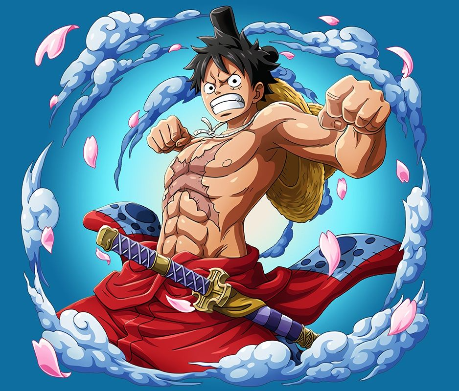

## Powered by OpenCV

I present here [Pixie - A Javascript PixelArt Generator](https://pixie-alpha.vercel.app/). 

The reason to why I decided to make this simple website was simple. I wanted a simple way to generate good-looking PixelArt without spending the hundreds of hours in coloring each pixel.

This was a very simple project I wanted to create in my free time, to reinforce my knownledge of OpenCV and creating a simple HTML page.

### Examples
<!-- | Original | Pixie |
| :----- | :----- |
|  |  |
|  |  | -->

| Original | Pixie |
| :----- | :----- |
|||
|||

### How it works

After many attemps, at using different upscaling and downscaling techninques, using different types of filters, I found the best pixellation consisted in 4 steps:

- Downsizing the image to a reasonable lower resolution image
- Applying an edge enhancing filter.
- Upscaling with no interpolation. We want 0 interpolation to keep the pixellated look
- Reduce the colour palette. By default the images have too many colours, and we want to keep a flat look to them

I also figured that we could automatically detect the main colours of a given image. Fortunately this work was already done by  https://github.com/zygisS22/color-palette-extraction.git

